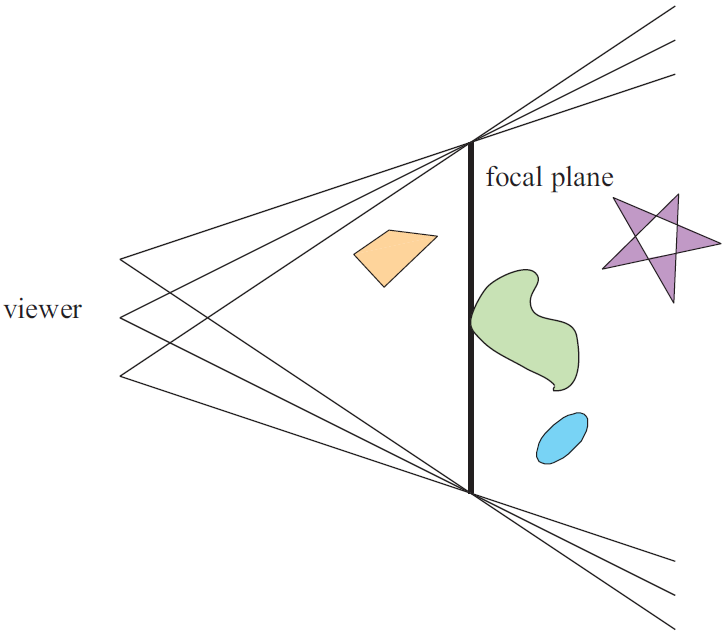

## Anatomy of Depth of Field (DOF)

Depth of Field (DOF) is a popular effect, used to convey a sense of of depth to a large scene, or in some cases, used as an artistic tool to transmit certain emotions and to alter the composition of a scene.

As the term "depth of field" intuitively suggests, it describes the range of distances from the camera within which objects appear sharp and fully in focus (Fig 1). Areas positioned closer or farther away than this range become progressively blurred. Before diving deeper into the computational methods and graphics implementations, let's take a moment to explore how depth of field occurs naturally in physical cameras .

### Real-world Cameras and DOF

To understand depth of field intuitively, we should briefly examine the two key physical components of real cameras: the **image sensor** and the **lens**.

The **image sensor** is essentially a flat, two-dimensional grid composed of millions of tiny, light-sensitive pixels. Each pixel collects incoming photons (particles of light), converting them into digital signals that computers or other digital devices process and store as images [[1](https://thinklucid.com/tech-briefs/understanding-digital-image-sensors/)].

The **lens** is equally crucial. Its main role is to bend (or refract) incoming light rays, much like the human eye does. Imagine the lens as a carefully shaped piece of glass designed to redirect parallel incoming rays of light to converge precisely onto a single point on the image sensor. Without a lens, these rays would scatter randomly across the sensor, resulting in blurry and indistinct images. Different types of lenses can converge or diverge rays differently, creating diverse visual effects, but the core principle remains consistent.

In real cameras, the depth of field range primarily depends on three key parameters:

- **Aperture**: The diameter and shape of the camera's opening.
- **Focal Length**: The distance from the lens to the image sensor (often called the "film-back").
- **Focal Distance**: Distance from the center of the lens to the real-life desired subject.

Let's delve deeper into these two factors.

### Aperture and its Impact on DOF

The **aperture** refers to the size of the camera's opening through which light enters. In physical terms, the aperture is controlled by an adjustable mechanism known as the **diaphragm**, consisting of multiple overlapping blades arranged in a circular shape. By opening or closing these blades, photographers control how much light enters the camera.

Aperture is measured in **F-stops**, which have an inverse relationship with the diameter of the camera’s opening (Figure 2):

- Lower F-stop values correspond to larger apertures (wider openings), allowing more light to enter. Larger apertures result in shallower depths of field, creating more pronounced blur effects in the foreground and background.
- Higher F-stop values correspond to smaller apertures (narrower openings), letting in less light but producing sharper images over a larger range of depths, thus less blur overall.

Reducing the aperture diameter (increasing F-stop) narrows the cone-shaped paths of the incoming rays. This narrower cone makes it easier for rays originating from different distances to converge closely enough to form a sharper image. At the extreme limit, if the aperture were infinitely small (like a pinhole camera—a theoretical camera model where the aperture is reduced to a tiny pinhole, allowing rays from nearly every distance to converge sharply), you would achieve almost infinite depth of field. However, smaller apertures admit less light, potentially causing underexposed (dark) images. Correcting this underexposure through longer exposure times can lead to unwanted motion blur or grainy noise artifacts.

Conversely, wider apertures result in broader cones of incoming rays, increasing divergence and blurring out-of-focus points into a circular shape on the image sensor. This blurred circle has a formal name in photography and rendering: the **Circle of Confusion (CoC)**.

### Focal Length and Zooming

The **focal length** describes the distance from the center of the lens to the image sensor (film-back), typically measured in millimeters (usually ranging from 50mm to 100mm). Adjusting the focal length essentially moves the sensor closer to or further away from the lens, changing how "zoomed-in" or "zoomed-out" the resulting image appears. Increasing the focal length (zooming in) narrows your field of view, emphasizing the blur effect in the out-of-focus regions.

 and F is the distance from lense to the focal point. Notice how, when distance I changes, the area of the projection stretches up and down. This is equivalent to zooming-in and zooming-out, but when doing so, the blur increases while zooming in and decreases otherwise.")

### Focal Distance (or Focal Plane)

The **focal distance** is simply the distance from the center of the camera lens to the subject of the shot. Changing it will alter what objects are considered in-focus and which are out-of-focus. Think of it as moving an imaginary plane on the camera's forward direction. Any object that is on or close to this imaginary focal plane, will be in-focus. Anything outside the DOF range will be blurred.

### Circle of Confusion (CoC) Explained

When out-of-focus objects project onto the sensor, their light rays do not neatly converge to a single point. Instead, these rays spread evenly across an area, creating a uniformly illuminated circular spot known as the **Circle of Confusion** (Figure 6). The shape of this circle depends on the diaphragm blades: more expensive cameras, having more blades, produce smooth, nearly perfect circles; cheaper cameras with fewer blades produce polygons, often pentagonal or hexagonal shapes. This phenomena is known as "bokeh" (Japanese word for blur) and it refers to the distinctive geometric shapes with which are high in local contrast that are mostly visible in the out-of-focus regions of the image (Figure 7).

. These shapes are given by the number and position of the diaphragm blades. As observed on the left lense, when the diaphragm is made out of a higher number of blades, it creates more circular Bokeh")

In computer graphics, the diameter of the CoC (measured in pixels) provides a practical measure of blur intensity, and hence, the DOF is formally defined as the range within which the CoC remains acceptably small [[2](https://developer.nvidia.com/gpugems/gpugems3/part-iv-image-effects/chapter-28-practical-post-process-depth-field)]:

- CoC diameter smaller than one pixel: points appear sharp and in-focus.
- CoC diameter greater than one pixel: points blur increasingly as diameter expands.

### From Real Cameras to Computer Graphics

In computer graphics, the virtual cameras we typically use are based on a simplified theoretical ideal camera model—the **pinhole camera**. As mentioned earlier, a pinhole camera has an infinitesimally small aperture (just a point), allowing rays from any distance to converge sharply onto the sensor, resulting in theoretically perfect focus across infinite depth (Figure 8). This model is just a first order approximation of the mapping from 3D to 2D scenes, because it does not take into consideration lense properties such as geometric distortions or blur.

 to pass through a single infinitesimal aperture, creating a perfectly sharp projection without lens-induced distortion or blur. Below, a real camera incorporates a lens, refracting rays so that they converge at a precise focal point before projecting onto the filmback. This lens-based approach accurately simulates realistic optical effects like depth of field, enabling scenes to capture nuanced focal transitions absent from the pinhole model.")

However, since real cameras don't behave like perfect pinhole cameras, we need computational methods to approximate real-world blur effects. Besides the accumulation buffer method and raytracing, most techniques do this through the approximation of the CoC value. Two common approaches exist:

- **Physically Accurate CoC**: Derived directly from the camera parameters through equations such as the Thin Lens Equation (Figure 9) [[3](https://developer.nvidia.com/gpugems/gpugems/part-iv-image-processing/chapter-23-depth-field-survey-techniques)].

- **Linear Approximation**: CoC value approximated through a linear function and clamped using Z-buffer values between user-defined bounds (Figure 10) [[4]()].

 does not change linearly with the distance of objects from the in-focus regions. A simple linear approximation (blue line) can be used to simplify the parameters and reduce the computational overhead.[ref]")

In practice, CoC values are represented in a range (-1, 1), signifying their relative position to the focal plane:

- Negative values correspond to the Near Field (closer to camera).
- Values around zero represent the Focus Field.
- Positive values correspond to the Far Field (further from camera).

## Methods for Rendering DOF

To efficiently render DOF effects, graphics pipelines generally separate the image into layers based on their CoC:

- **Focus Field**: Near the focal plane (sharp, CoC < 1px).
- **Near Field**: Closer than the focal plane (blurred foreground).
- **Far Field**: Farther away than the focal plane (blurred background).

Rendering these layers separately simplifies handling different blending behaviors:

- **Near Field**: Requires blending transparency at edges (semi-transparent blur).
- **Far Field**: Must avoid haloing around sharp objects, handled carefully.

Most methods follow this workflow:

1. Calculate per-pixel CoC from depth buffer.
2. Split image into layers using CoC masks.
3. Downsample and apply blur to layers independently.

In subsequent chapters, we explore various DOF rendering techniques—including Scatter-Based, Gather-Based, and Scatter-As-You-Gather methods—in greater detail.

### Simulating DOF (Ground Truth)

To truly understand and evaluate Depth of Field rendering methods in computer graphics, it was important to have a reliable reference—a sort of "ground truth" to compare against. Such a ground truth could be simulated accurately using an approach known as the **Accumulation Buffer (AB)** method. An AB is just a high precision color buffer that is used to store multiple images inside of it [[3](https://developer.nvidia.com/gpugems/gpugems/part-iv-image-processing/chapter-23-depth-field-survey-techniques)].

Imagine you're holding a real camera, focusing precisely on an object placed at a certain distance—the focal plane. If you slightly move the camera around this focal plane while always keeping it pointed directly toward it, you'll notice something interesting:

- Objects exactly on or near the focal plane stay relatively sharp because their position relative to the sensor doesn't change significantly.
- Objects far away from this plane (either closer or further) shift more dramatically across your sensor from one camera position to another. As you average these multiple views, these areas naturally blur.

In the world of computer graphics, the **Accumulation Buffer method** digitally replicates this intuitive physical process. The focal plane stayed fixed, and the virtual camera's position is moved slightly multiple times, each time capturing a snapshot of the scene from these different viewpoints (Figure 12). These snapshots are then combined—summed up and averaged—to produce the final image.

The more snapshots or samples taken, the closer the resulting image is to real-world accuracy. A limited number of snapshot can result in ghosting, just straight up copying of objects, or bending artifacts when high blur is present. As a rule of thumb, you can estimate the number of accumulation passes required for realistic DOF by dividing the area of the largest CoC by the number of pixels you’re willing to tolerate per sample. For high-quality results with minimal banding (limited to about 2×2 pixel blocks), aim for one pass per 4 pixels of CoC area—for example, a CoC with an 8-pixel radius (≈200 pixels in area) would require about 50 passes (200 /4). For a more performance-friendly but lower-quality approximation, you can stretch that to one pass per 9 pixels of CoC area, tolerating up to 3×3 pixel blocks of blur and reducing the pass count significantly—for instance, down to about 12 passes for a 6-pixel-radius CoC. This trade-off between visual fidelity and rendering cost is key when tuning for real-time vs. offline rendering[[3](https://developer.nvidia.com/gpugems/gpugems/part-iv-image-processing/chapter-23-depth-field-survey-techniques)]. Consequently, there is a significant cost: rendering each viewpoint separately means that this technique is computationally expensive. Because of this, the accumulation buffer method is rarely used directly during real-time rendering. Instead, it serves as a reliable benchmark, allowing developers and artists to qualitatively compare and refine faster but less physically accurate DOF approximations.

All subsequent rendering methods we discuss attempted to approximate this accurate simulation in different ways—each exploring and solving the Depth of Field problem from various perspectives, especially in terms of efficiently approximating the Circle of Confusion (CoC).

### Scatter-Based (Forward Mapping) Method

In scatter-based depth of field techniques, each pixel scatters its shading value to its neighbours. Unfortunately, scattering operations do not map well to current shader capabilities as it requires some level of synchronisation that would affect the parallel nature of GPUs. One solution that worked well in practice is the usage of sprites. Each out-of-focus pixel is transformed into a **sprite**—a piece of geometry, typically a rectangle or circle, with a texture attached to it —that represents how much that pixel should blur across the screen. The size of this sprite is driven by the **Circle of Confusion (CoC)**, a value derived from the z-buffer.

To build an intuition, imagine a **white square the size of 1 pixel** floating in 2D space. If that pixel is in focus, it stays sharp—affecting only its original screen-space location. We now take that tiny white quad and **scale it up** using the CoC value, spreading it in nearby pixels. The result? Its contribution **overlaps neighboring pixels**.

So rather than computing blur by pulling in nearby samples (as in gather-based methods), **each pixel scatters its own influence outward**, like dropping a pebble and watching ripples expand.

In practice, this is often implemented using a **Geometry Shader**, a programmable stage in the GPU pipeline that can dynamically emit geometry based on input data. Here, it reads the pixel’s depth, calculates its CoC, and then **emits a triangle-based sprite**, scaled accordingly (see Figure 13) [[5](https://bartwronski.com/2014/04/07/bokeh-depth-of-field-going-insane-part-1/)] 

Geometry information of the sprite is then sent to a Pixel Shader (PS), where a custom bokeh texture is sampled, and each sprite rasterised and blended into the final image using **additive alpha blending**. Additive blending combines the colors of overlapping sprites, creating a cumulative blur effect. Finally, these sprites are composited into a single coherent image by averaging, normalizing, and upscaling the resulting blurred layers.

This process is intuitive and straightforward: it is called "scattering" because each blurred pixel scatters its influence outward onto surrounding pixels. However, the scatter-based method faces significant challenges when executed on GPUs: 

- Graphics Processing Units (GPUs) are designed around massive parallelisation—running thousands of threads simultaneously to render images rapidly. This parallelism relied on threads operating independently with minimal synchronisation. Scattering is equivalent to a write operation, however, doing so on GPUs require multiple threads to coordinate frequently, as they have to write results to overlapping pixel locations simultaneously, causing synchronisation bottlenecks [[6](https://developer.nvidia.com/gpugems/gpugems2/part-iv-general-purpose-computation-gpus-primer/chapter-32-taking-plunge-gpu)]. This is partially solved through the usage of sprites, however, the variability in performance yielded by such methods makes them less suitable for real-time applications [[7]()]. This variability is mostly given by the high fill rate and bandwidth required by drawing a quad for each pixel [[10]()].

- Scatter-based methods are notoriously tricky when combined with other translucent effects such as smoke, fog, or particle systems. Since each of these effects also involved transparency and blending, compositing them with scatter-based DOF methods became complicated. Often, developers had to give artists explicit control over the order in which different effects or materials were composited [[8](https://www.gdcvault.com/play/1014666/-SPONSORED-The-Technology-Behind)] (e.g., DOF before or after particles), adding complexity and additional time to the artistic workflow (Figure 14)

### Gather-Based (Backward Mapping)

To better understand the gather-based method, let's first revisit briefly what we learned about scatter-based (forward mapping) methods. Recall that in scatter-based methods, each pixel "spreads" its blur to nearby pixels. While straightforward conceptually, this isn't very GPU-friendly due to synchronization complexities.

**Gather-based methods**, on the other hand, flip this logic upside down. Instead of scattering, each pixel "gathers" or collects information from neighboring pixels around it (Figure 15). Imagine you're trying to figure out the exact shade of color your pixel should be. Instead of telling your neighbors, "Here’s my blur!", you ask your neighbors, "What blur should I be seeing here?" This subtle yet important inversion aligns very naturally with GPU architectures because GPUs excel at sampling data from nearby memory locations. Sampling nearby pixels—essentially reading memory that's close together [[9](https://www.nocentino.com/Nocentino10.pdf)]—is exactly the kind of task GPUs do exceptionally efficiently . This hardware capability makes gather-based approaches attractive from both a performance and implementation standpoint

 and gather-based (right) methods. Figure courtesy of Akenine-Möller et al., Real-Time Rendering, 4th Edition. Used under Fair Use.")

The unfortunate aspect about these methods is the **Neighborhood Assumption**. Gathering inherently assumes that neighboring pixels have similar depth values, meaning they're part of the same object or closely related objects. However, at object boundaries—where depth values shift drastically—this assumption can break down, leading to visible artifacts like haloing.

Let's visualize this haloing effect intuitively: imagine you're sampling colors for a pixel at the edge of a in-focus foreground object. Some gathered samples accidentally include background pixels due to a large CoC radius. Blending these distant pixels creates unwanted halos around the object's edge, breaking visual realism (Figure 15). 

, causing a noticeable halo around the nose. On the right, the reverse scenario occurs—the character is blurred while the background remains sharp. Here, sharp background details (like the sky) bleed onto the blurred edges of the character. Both cases highlight the fundamental challenge with gather-based methods: they indiscriminately blend pixel information across depth boundaries, resulting in visual artifacts known as haloing and color bleeding.")

To summarize, gather-based (backward mapping) methods elegantly leverage GPU strengths by shifting complexity away from scattering information to intelligently gathering it. While highly efficient and broadly effective, handling edge cases at object boundaries remains a nuanced challenge, necessitating careful management of sampling strategies and edge-aware filtering techniques.

### Scatter-as-you-Gather (Hybrid Method)

We've previously discussed two distinct approaches for rendering Depth of Field: the **Scatter-Based** method, where each pixel actively spreads its color to neighboring pixels, and the **Gather-Based** method, where each pixel passively pulls colors from its neighbors. Each approach comes with its unique advantages and inherent limitations. Interestingly, there's a clever hybrid approach—often called the **Scatter-as-you-Gather** method—that blends the strengths of both these worlds.

To combine the efficiency of gathering with the precision of scattering, we use a hybrid method: **scatter-as-you-gather**. This method smartly flips the scattering problem on its head. Instead of each pixel blindly pushing its color outward, pixels carefully examine their neighbors and selectively decide whether a neighbor’s color should "scatter" into them.

Here's an intuitive breakdown of the process (see **Figure 13** for a visual overview):

1. **Gather Phase**: For each pixel, we first gather color and depth information from neighboring pixels within a radius defined by the current pixel’s own Circle of Confusion (CoC). Remember, the CoC size indicates how blurry a pixel should appear—the larger the CoC, the more blurred the pixel.
2. **Scatter Decision (Depth-Based Selection)**: After collecting these neighboring pixels, the algorithm evaluates each neighbor’s own CoC to determine if and how their blurred color could affect the current pixel. Think of this as each pixel "asking" its neighbors:
    
    > “Does your blur overlap with my location?”
    
    To resolve conflicts—where multiple neighboring pixels potentially scatter into one pixel—the algorithm prioritizes by depth: the pixel closest to the camera (lowest z-depth) is chosen as the **near image**. Remaining neighbors close in depth to the neighbor with lowest z-depth are combined using alpha-blending, averaged together and stored in a **foreground** texture. Blending pixels in this manner gets rid of the need for sorting based on depth (which is a common performance bottleneck)
3. **Background Layering and Final Composition**: Pixels that do not significantly scatter into our current pixel (usually those further back or less blurry) are grouped into a separate background layer. Finally, the carefully crafted foreground layer is composited over this background layer using alpha blending to produce the final, visually coherent result.

In summary, what sets this method apart comes down to a few key strengths:
- **Reduced Haloing and Edge Artifacts**: By carefully selecting neighboring pixels based on their CoC and depth, this method reduces problematic halos around objects. It's particularly effective in rendering realistic transitions between blurry foreground objects and the sharp focus region behind them.
- **Efficient GPU Implementation**: Although the method introduces an extra complexity step—evaluating neighbors—it remains highly compatible with GPU architectures. GPUs excel at independent gather operations, and this hybrid approach leverages that strength while mimicking scattering through a carefully controlled selection process.
- **No Need for Depth Sorting**: Traditional scatter-based methods might require sorting pixels to correctly composite translucent layers—a computationally expensive process. The hybrid method sidesteps this requirement entirely through smart alpha blending, achieving visually accurate results without performance hits.
    
Despite its strengths, this method isn’t without trade-offs. The shader logic can become quite intricate, especially when handling edge cases involving large blur radii or dense depth discontinuities. More blur means more neighbors to evaluate, which can add up computationally. In practice, optimizations or approximations are often needed to maintain performance in high-CoC scenarios.

## References
- \[1\] https://thinklucid.com/tech-briefs/understanding-digital-image-sensors/
- \[2\] https://developer.nvidia.com/gpugems/gpugems3/part-iv-image-effects/chapter-28-practical-post-process-depth-field
- \[3\] https://developer.nvidia.com/gpugems/gpugems/part-iv-image-processing/chapter-23-depth-field-survey-techniques
- \[4\] GPU Zen Gather-based DOF
- \[5\] https://bartwronski.com/2014/04/07/bokeh-depth-of-field-going-insane-part-1/
- \[6\] https://developer.nvidia.com/gpugems/gpugems2/part-iv-general-purpose-computation-gpus-primer/chapter-32-taking-plunge-gpu
- \[7\] Real-time Rendering
- \[8\] https://www.gdcvault.com/play/1014666/-SPONSORED-The-Technology-Behind
- \[9\] https://www.nocentino.com/Nocentino10.pdf

- \[10\] https://xeolabs.com/pdfs/OpenGLInsights.pdf
---
- https://ia800704.us.archive.org/32/items/crytek_presentations/Sousa_Graphics_Gems_CryENGINE3.pdf

- [Pharr and Humphreys 10] Matt Pharr and Greg Humphreys. Physically Based Rendering,
Second Edition: From Theory To Implementation, Second edition. San Francisco, CA:
Morgan Kaufmann Publishers Inc., 2010. (PINHOLE CAMERA REF)
