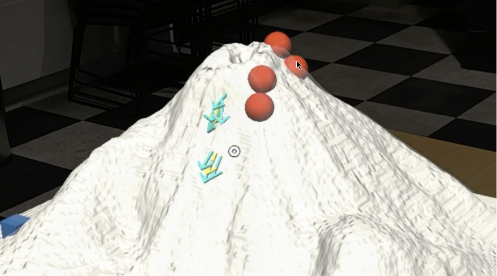
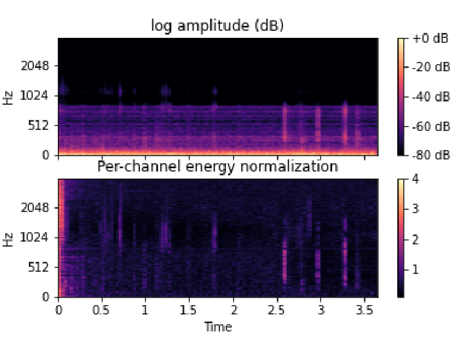

## [Real-time Rendering of Water Reflections in VR](https://repository.tudelft.nl/record/uuid:6a14ca81-a277-4a1b-b45f-b6ac50b45045)



Rendering accurate water reflections is crucial for achieving realism in computer graphics. Their integration with VR and AR technologies can further elevate experiences in sectors like education, engineering, and medicine. Even though various monoscopic reflection techniques exist they either demand substantial computational resources or cannot be straightforwardly adapted to stereoscopic media, leaving a big hole in research concerning stereo-aware reflections and their applications. This thesis researches and analyses the different techniques for water reflections. Further, it makes significant strides in the development of stereo-consistent real-time water reflections for XR platforms. This is achieved by combining implicit functions and bounding volume hierarchies (BVH) into a unified system called Adaptive Hierarchical Signed Distance Fields Reflections (AH-SDFR). It was found that AH-SDF outperforms leading methods such as Hierarchical Screen Space Reflections (HSSR) and Reflection Probes in both visual quality and performance, and as a result, it offers a promising solution for XR applications. However, challenges persist, mainly due to
the large memory demands of intricate 3D scenes and perceptual errors from inaccuracies in volume textures.



---

## [Mathisfactory](https://github.com/cristianrosiu/mathisfactory/blob/main/report.pdf)



Rendering accurate water reflections is crucial for achieving realism in computer graphics. Their integration with VR and AR technologies can further elevate experiences in sectors like education, engineering, and medicine. Even though various monoscopic reflection techniques exist they either demand substantial computational resources or cannot be straightforwardly adapted to stereoscopic media, leaving a big hole in research concerning stereo-aware reflections and their applications. This thesis researches and analyses the different techniques for water reflections. Further, it makes significant strides in the development of stereo-consistent real-time water reflections for XR platforms. This is achieved by combining implicit functions and bounding volume hierarchies (BVH) into a unified system called Adaptive Hierarchical Signed Distance Fields Reflections (AH-SDFR). It was found that AH-SDF outperforms leading methods such as Hierarchical Screen Space Reflections (HSSR) and Reflection Probes in both visual quality and performance, and as a result, it offers a promising solution for XR applications. However, challenges persist, mainly due to
the large memory demands of intricate 3D scenes and perceptual errors from inaccuracies in volume textures.



---

## [Multi-task Seals Auscultation Classification](https://github.com/cristianrosiu/deep-auscultation-classifier/blob/main/paper.pdf)



Pulmonary auscultation is one of the most valuable and fundamental tools available to veterinarians to assess lung conditions in animals quickly. Despite all the advances in the medical field, electronic chest auscultation can sometimes represent an unreliable method due to the non-stationary property of lung sounds. Automating this process can aid the clinicians in their diagnosis process and hopefully improve the survival rate of seals that arrive at the Pieterburen Zeehondencentrum in Groningen. One way to do this is through means of deep learning. However, most of the time, audio classification tasks are usually treated as independent tasks. As lung sounds are known to be related to one another in some form or shape, a single-task approach, by focusing only on one task, misses most of the information necessary to make a difference when classifying closely related tasks. This paper aims to show the potential of multi-task learning (MTL) in the context of seals lung sound classification. We proposed three different types of multi-task convolutional neural network architectures. These models are evaluated on the mel-cepstral coefficients (MFCCs) features and per-channel energy normalized spectrograms (PCEN). Experiments are conducted on a dataset of 142 samples gathered from both the left and right lungs of multiple seals. The two types of abnormal sounds present in this dataset are Wheezing and Rhonchus. Results show that the MFCC features, together with our custom-built CNN obtained an accuracy of 73% when classifying wheezing and 63% in the case of rhonchus, outperforming the classification of PCEN images by 15% and 25% respectively. Lastly, the same model manage to obtain a survival prediction accuracy of 80% and succesfully showing the potential of MTL in auscultation classification.

